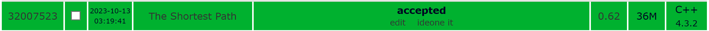
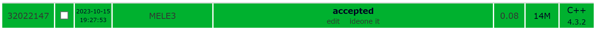
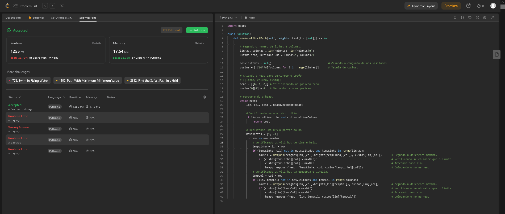

# Exercicios2

**Número da Lista**: 2 
**Conteúdo da Disciplina**: Dijkstra, Prim, Kruskal 

## Alunos

| Matrícula  | Aluno                       |
| ---------- | --------------------------- |
| 21/1029147 | Arthur de Melo Viana        |
| 21/1029666 | Matheus Henrique Dos Santos |

## Sobre

Exercícios do Sphere Online Judge:

- [SHPATH - The Shortest Path](https://www.spoj.com/problems/SHPATH/)
- [MELE3 - MELE3](https://www.spoj.com/problems/MELE3/)

Exercícios do LeetCode:

- [1631 - Path With Minimum Effort](https://leetcode.com/problems/path-with-minimum-effort/)
- [1368 - Minimum Cost to Make at Least One Valid Path in a Grid](https://leetcode.com/problems/minimum-cost-to-make-at-least-one-valid-path-in-a-grid/)

## Screenshots

A seguir as imagens dos algoritmos enviados no juiz. É possível observar os status de conclusão do problema e uma descrição do algoritmo utilizado.

### SHPATH - The Shortest Path

Utilização do algoritmo de Dijkstra com lista de adjacência e heap de mínimo da STL (Standard Template Library) do C++. Em uma lista de cidades, precisa encontrar a menor distância entre duas cidades dado o nome de ambas, sendo um grafo direcionado.

### MELE3 - MELE3

Utilização do algoritmo de Dijkstra com lista de adjacência e heap de mínimo da STL (Standard Template Library) do C++. Dada uma quantidade N de elevadores e K de pisos, o programa deve imprimir uma única linha com o menor caminho do primeiro andar até o último andar, sabendo que todos os elevadores param em apenas 2 pisos e que eles percorrem um andar em 5 segundos. Quando atingem o piso de destino, começam a descer. Caso o elevador esteja no mesmo piso no momento, pode-se trocar imediatamente de elevador.

### 1631 - Path With Minimum Effort

Utilização do algoritmo de Dijkstra com matriz e heap de mínimo em python. Em uma matriz 2D, cada célula possui um tamanho/altura e é desejado encontrar o caminho com o menor esforço, ou seja com a menor variação de altura, entre a célula (0,0) até a célula (n,n). O esforço é definido como sendo a diferença máxima absoluta entre as alturas das células.

## Instalação

**Linguagem**: C++, Python 

Para rodar os arquivos em C++, é recomendado utilizar o WSL caso esteja no Windows. Nele, execute os comandos `sudo apt update` e `sudo apt install build-essential` para instalar o g++. O código em C++ também pode ser enviado no próprio [SPOJ](https://www.spoj.com/) ou compilado e executado no [Ideone](https://ideone.com/). Já para rodar os arquivos em Python, pode ser utilizado o interpretador online [GDB](https://www.onlinegdb.com/) ou instalar o Python na sua máquina (as instruções para instalação podem ser encontradas no [guia de instalação](https://wiki.python.org/moin/BeginnersGuide/Download)).

## Uso

Para os exercícios em C++, compile o código utilizando `g++ -o prog arquivo.cpp` e execute-o utilizando `./prog`, por fim, digite o input no terminal. Também pode ser utilizado o comando `./prog < entrada.txt` caso exista algum caso de teste válido no arquivo de texto. Os links para os problemas resolvidos estão na seção "Sobre".

Para os exercícios em Python, basta digitar `python nome-do-arquivo.py` no terminal de preferência.

## Vídeo

Para acessar o vídeo explicativo sobre os exercícios, [clique aqui]().
